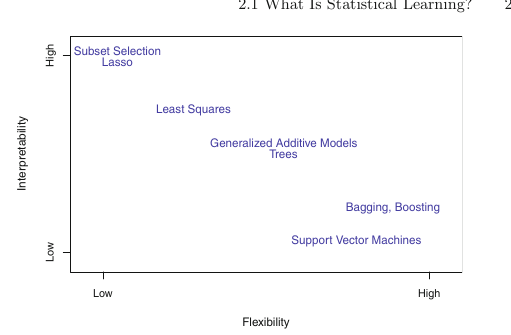
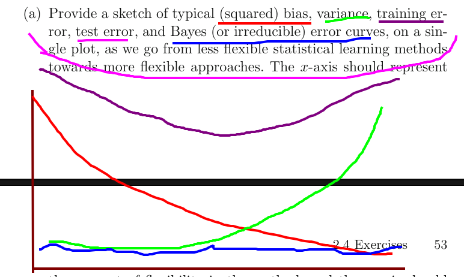
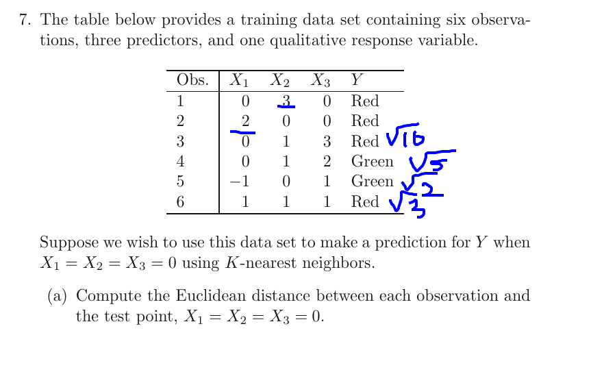

# Notation
A dataset contains *p* features and has *n* datapoints
so s dataset that has weight, length, age of 1000 people has 
p=3 features and n=1000 points.

# Chapter 2 : Statistical learning

## 2.1 What is statistical learning?
Statistical learning is the method were we take in a set of **features, predictors, or independent variables**
to predict the **response or dependent variable** 
The first are generally called X and the latter called y.

The function looks like this:

y = f(X) + $\epsilon$
where f(X) is the systematic info about y and $\epsilon$ is the random, non-reducable error. y(X) also contains an error,
but that can be reduced by selecting another, more appropriate model to train. $\epsilon$ is nonzero, because it may contain variables we haven't measured, for example if we were predicting how a patient might respond to drugs but didn't measure the weight of patients, or may contain unmeasurable variances, such as manufacturer variance in pillmaking so each pill doesn't contain exactly the same ammount of active ingredient.

The irreducable error will always place an upper bound on the accuracy of our model, and in practice, we will not know what the value of this error is.

### Inference

We don't always want to predict y, we sometimes just want to know the relationship betwen X and y. When doing this, we don't want $\hat{y}$ to be treated like a black box.
In this setting, we may be seeking one or more of the following answers:

1. Which predictors are associated with the response? It's often the case that only some of the features are ehavily associated with y, and identifying the few important factors out of a large set of variables may be worthwile.

2. What is the relationship between the response and each predictor? Features may have a possitive or negative or no correlation with theresponse. Depending on the complexity of f, the relationship between the response and a given predictor may also depend on the values of the other predictors.

3. Can the relationship between Y and each predictor be adequately summarized using a linear equation, or is the relationship more complicated? Historically, we've used linear methods to estimate f(X), which sometimes is reasonable and desirable, but often the relationship is more complicated.

Modeling can also be done for both inference and prediction purposes.  Depending on what our goal is, different methods of estimating f will be appropriate. For example, *linear models* allow for relatively simple and interpretable inference, but may not yield as accurate predictions, while some highly nonlinear approaches may provide very accurate predictions, but will be less interpretable.

### 2.1.2 How do we estimate f?
We'll explore various approaches throughout this book, and these book generally share some characteristics. We will always assume that we observed a set of *n* datapiubts, and these are called training data because we'll use this data to train, teach, fit the model. $x_{ij}$ is the value of the j'th predictor for observation i. 
Correspondingly, $y_i$ is the response variable for the i'th observation. 
Then our training data consists of 
$\{(x_1, y_1), (x_2, y_2), \dotso (x_n, y_n)\}$ where $x_i = (x_{i1}, x_{i2}, \dotso , x_{ip} )^T$

Our goal is to apply a method to the training data in order to estimate the unknown function f. In other words, we want to find the function $\hat{y}$ such that $Y \approx \hat{f}(X)$ for any observation (X,Y). Broadly speaking, most methods can be divided into either *parametric* or *non-parametric.*

### Parametric methods
These methods invove a 2 step model-based approach
1. First, we make an assumption about the form or shape of f. For example, a simple assumption is that f is linear:
f(X) = a0 + b1 X1 + b2 X2 + ... + bp Xp
This is a linear model, extensively discussed in chapter 3.  Once this assumption is made, the problem of estimating is greatly simplified. Instead of having to estimate an entirely arbitrary p-dimensional function f(X), we only need to estimate p+1 coefficients. 

2. After a model has been selected, we use a procedure that fits or trains the model. In case of the linear model, we need to estimate the parameters. The most common approach to fitting the model is the *(ordinary) least squares.* However, this is only one of the possible ways.

The model based approach is refered to as parametric; it reduces the problem of estimating f down to estimating a set of parameters. The downside is that the chosen model will usually not match the true unknown form of f. If our model is too far from true f, our estimate is poor. We can try to adress this problem by choosing a *flexible* model that can fit many different possile functional forms of f. But in general, fitting a more flexible model requires estimating a greater number of parameters, and these more complex models can lead to *overfitting* the data, meaning they follow the errors/noise too closely. 

### Nonparametric methods
These methods don't make explicit assumptions about the functional form of f. Instead, they seek an estimate of f that gets as close as possible to the datapoints without being too rough or wiggly. 
These approaches have the potential to acurately fit a wider range of possible shapes of f. The major disadvantage is that since they don't reduce the problem to a small number of parameters, they need far more observations to train on. 
This method tries to produce an estimate for f that is as close as possible to the data that's as smooth as possible. (Look into thin plane spline) In order to fit a thin-plate spline, we must select a level of smoothness. In general, the lower the level of smoothness (the rougher the tps), the higher the chance of overfitting. We'll discuss choosing the correct ammount of smoothness in later chapters. 

## 2.1.3 Tradeoff between prediction accuracy and model interpretability

Of the multitude of methods we'll examine, some are less flexible  or more restrictive, in the sense that they can produce a relatively small range of shapes to estimate f. For example, linear regression is a rel. inflexible approach, because it only generates linear functions. 

Why would we ever choose a more restrictive method, then?
If we're interested in inference, we want a more interpretable model.  very flexible approaches, can lead to such complicated estimates of f that it is difficult to understand how any individual predictor is associated with the response.

This doesn't mean that when we only want to predict,that we should choose the most flexible model. This will not always yield the most accurate prediction, because the potential of overfitting is larger. 

### 2.1.4 Supervised vs unsupervised learning
We can also divide the statistical learning problems like so. Thus far, we've only looked at examples in the supervised learning domain. Many classical statisitcal learning methods such as linear regression, logistic regression, GAMs, boosting and support vector machines fall into the supervised category, and the majority of this book falls into this category.
Supervised mean that for every $x_i$, we have a response $y_i$.  In unsupervised, we have xi but no associated yi. We lack a response variable that can supervise our analysis. 
What statistical analysis is possible, then?  We can seek to undersand the relationship between variables or between observations. One statistical learning tool we can use is cluster analysis or clustering, where the goal is to say wether observations fall into relatively distinct groups. For example, a marketing segmentation study where we observe multiple variables for potential customers, such as income, location and shopping habbits. We might believe we have groups such as big spenders and low spenders. We could try to cluser the customers based on the available vars into these groups. 

This might be easy with a visual inspection if we have 2 vars, but is practically impossible when he have more than 3 vars, which we often do. 

Sometimes, the question of wether we're using a supervised or unsupervised method is less clearcut. We may have n observations and m < n observations. This arises when the response is more difficult/expensive to collect compared to the inputs. We refer to these kind of problems as semi-supervised learning problems, and these are beyond the scope of this book. 

### 2.1.5 Regression vs classification problems

Vars can be divided in quantitative or qualitative(categorical)
We tend to refer to problems with a quantitative response as regression problems, while those involving qualitative responses as classification problems. The distinction isn't always distinct. logistic regression is often used with qualitative binary response. But since it estimates class probabilitites, it can be thought of as a regression method as well. 

We tend to select the method on the basis of wether the problem is quantitative or qualitative, we might use linear regression when quantitative and logistic regression when qualitative. However, wether the features are qualitative or quantitative is less important. Most methods discussed in this book can be used regardless of predictor type, provided that we properly *code* the qualitative predictors before the analysis. 

## 2.2 Assessing model accuracy
Different approaches produce different results, and some approaches will be more appropriate and accurate for a given problem. 
We will discuss some of the most important concepts that arise in selecting a method for a specific data set. We'll explain how these can be applied later on. 

### 2.2.1 Measuring the quality of fit
In order to measure the performance of a learnign method on a data set, we need a way to measure how well the predictions match the observed data. When using regression, the most used measure is *mean squared error* MSE. It's the summation of the squared difference between predicted response and actual response, divided by the number of rpedictions. 
We typically split all the available data in a training set, and a set to get the accuracy from. 

A fundamental property of stat. learning methods is that as model flexibility increses, training MSE decreases, but test MSE may not. When a given method yields a small training MSE but large test MSE, we are overfitting the data. This happens when the method is working too hard to find patterns in the training data and may pick up patterns caused by random chance. when we overfit, the test MSE will be very large because the supposed pattern that the method found simply doesn't exist in the test data. We should note that test MSE will always be larger than training MSE. **Overfitting specifically refers to cases where a less flexible bodel would have yielded a smaller test MSE**

In practice, its usually easy to compute training MSE, but test MSE may be harder because there's no test data available. 
As we can see in the examples, the flexibility level corresponding with minimal test MSE can vary considerbly among data sets. We;ll discuss a number of appoaches that can be used to estimate the minimum point. An important method is cross validation.

## 2.2.2 The bias variance tradeoff

It can be shown that the expected test MSE can be decomposed in the sum of the variance and squared bias of expected f and the variance of error term e
$$
E(y_0- \hat{f}(x_0))^2 = Var(\hat{f}) + (bias(\hat{{f}}))^2 + Var(\epsilon)
$$

This equation tells us that in order to minimize the expected error, we need a method that both archieves a low variance as a low bias. 
**Variance** refers to the amount by which f would change if we
estimated it using a different training data set. In general, more flexible statistical methods have higher variance. 
On the other hand, **bias** refers to the error that is introduced by approximating a reallife problem, which may be extremely complicated, by a much simpler model. Generally, more flexible methods result in less bias. As a general rule, as we use more flexible methods, the variance will increase and the bias will decrease.

`The relative rate of change of these two quantities determines whether the test MSE increases or decreases. As we increase the flexibility of a class of methods, the bias tends to initially decrease faster than the variance increases Consequently, the expected test MSE declines. However, at some point increasing flexibility has little impact on the bias but starts to significantly increase the variance. When this happens the test MSE increases. 
The challenge lies in finding a method for which both the variance and the squared bias are low. This trade-off is one of the most important recurring themes in this book.

## 2.2.3 The classification setting
So far, our discussion of model accuracy has been focused on regression, but many of the concepts also transfer over to the classification setting wih only some minimal modification due to the fact that y is no longer numerical. 

We now use error rate, the average of times where expected y is not y. 

### the Bayes classifier
It is possible to show that the test error rate given in (2.9) is minimized, on average, by a very simple classifier that assigns each observation to the most likely class, given its predictor values. In other words, we should simply assign a test observation with predictor vector x0 to the class j for which the probability conditional that Y = j given the observed predictor vector x0 is the largest. 
$$
 P(Y=j| X=x_0)
$$
 This very simple classifier is called the Bayes classifier.
In a 2class/binary problem, the Bayes classifier corresponds to class1 if the probability  P(Y=1| X=x0) > 0.5, and to the other if otherwise. 

The Bayes classifier produces the lowest possible test error rate, called the *Bayes error rate*. Since the Bayes classifier will always choose the class for which the probability is the largest,  the error rate at X = x0 will be 1−maxj  P(Y=j| X=x0).  
In general, the Bayes error rate is given  by 
$$
1 - E( max j P(Y=j| X=x0) )
$$
where the expectation averages the probability over all possible values of X. 

##  K nearest neighbours
In theory we would always like to predict qualitative responses using the Bayes classifier. But for real data, we do not know the conditional distribution of Y given X, and so computing the Bayes classifier is impossible. Many approaches attempt to estimate the conditional distribution of Y given X, and then classify a given observation to the class with highest estimated probability. One such method is the K-nearest neighbors (KNN) classifier.

Given a number K and x0, it first identifies the K training points closest to x0 (repr. by $\mathcal{N}_0$.) It then estimates the conditional probability for class j as the fraction of points in N0 whose response values equal j. Finally, KNN applies Bayes rule and classifies the test observation x0 to the class with the largest probability.
So, for example, if i have xi and k=9, and 7 out of the 9 neighbours are B and 2 are A, we'll get a 7/9th probability that xi is B.

The choice of K has a drastic effect on the KNN classifier obtained. When K is low, the decision boundary is overly flexible and finds patterns in the data that don’t correspond to the Bayes decision boundary. This corresponds to a classifier that has low bias but
very high variance. As K grows, the method becomes less flexible and
produces a decision boundary that is close to linear. This corresponds to a low-variance but high-bias classifier. Just as in regression, there is a similar disparity between training error rate and test error rate. 

Excercises:
For each of parts (a) through (d), indicate whether we would generally
expect the performance of a flexible statistical learning method to be
better or worse than an inflexible method. Justify your answer.
## I. The sample size n is extremely large, and the number of predictors p is small.

**I expect the variance(the variance i learned at school) between datasets to be low since it's a huge dataset, since there are many data points, so what we could try to do is select a method that decreases the bias. Since bias tends to decrease faster than variance increases as flexibility increases, I'd try to go with a more flexible method**

2. The number of predictors p is extremely large, and the number
of observations n is small.
**Small number of observations already points towards using a less flexible method, since these generally need less datapoints. So I'd go towards that direction. And since the previous question is essentially the opposite, and i selected the more flexible method, i guess this would take the less flexible method**

3. The relationship between the predictors and response is highly
non-linear.

**Now, we can say that if we chose an inflexible one, we'd get more bias, because we're trying to greatly simplify the model. I would go towards a more flexible method. At least, not a method that can only handle y being linear**

4. The variance of the error terms, i.e. σ 2 = Var(), is extremely
high.

**I would try a method that tried to reduce the variance, so this would point me towards a method that's less flexible**

## Explain whether each scenario is a classification or regression problem, and indicate whether we are most interested in inference or prediction. Finally, provide n and p.

We collect a set of data on the top 500 firms in the US. For each firm we record profit, number of employees, industry and the CEO salary. We are interested in understanding which factors affect CEO salary.  
**n=500 and p = 4. This looks more like an inference problem than a prediction problem, since you're interested in the relationship between predictors and response. I'd also say that it looks more like a classification problem, in the sense that we'd be interested if the salary goes up/down as x1, x2, etc increases**

We are considering launching a new product and wish to know
whether it will be a success or a failure. We collect data on 20
similar products that were previously launched. For each prod-
uct we have recorded whether it was a success or failure, price
charged for the product, marketing budget, competition price,
and ten other variables.

**This is definitely a classification problem, and we're more interested in prediciton than inference. We have n=20 and p = 14**

We are interested in predicting the % change in the USD/Euro
exchange rate in relation to the weekly changes in the world
stock markets. Hence we collect weekly data for all of 2012. For
each week we record the % change in the USD/Euro, the %
change in the US market, the % change in the British market,
and the % change in the German market.

**Prediction over inference, and regression. p=4 and n=52 * 8**

 Explain why each of the five curves has the shape displayed in
part (a).

1. Bias. This is the error that occurs by the discripancy between the model and the real world problem. As flexibility increases, this allows us to create a model that's more similar to the real world problem, and thus bias decreases. 
2. Variance. as flexibility increases, we're fitting the data more closely, and may get patterns caused by random chance. This means that when we use the model on another data set, which probably won't have those patterns, we will get a higher variance.
3. this is the addition of the above 2.
4. this is loosely linked to 3.
5. This is the irreducable error, neither increasing or decreasing the error should have an effect.

Describe three real-life applications in which classification might
be useful. Describe the response, as well as the predictors. Is the
goal of each application inference or prediction? Explain your
answer.

**We could try predict wether the stock of a company goes up or down. It's primarily prediction, and the responses would be up/down. The predictors would be competitors and past stock history. 
We could try to see wether some disseases increase the likelyhood of havind diabetes. This would be an inference problem, with predictors being having various other disseases, and response being yes/no. We could try to look at age, sickness, activity level, stuff like that and mortality rate of corona virus patients. This would be an inference problem, and the response whould be yes/no death.**

Do the same, but with regression.
**Stock price, with predictors being competitors, downstream suppliers, past stock prices. Test score, with predictors like past test scores, socioeconomic standing, hours spent studying, classes missed. Value of some art thing, predictors being artist, genre, date, twitter followers of artist**

Describe three real-life applications in which cluster analysis
might be useful.

**party alliance, with predictors being location, income, age, gender. Loan riskiness, with income, occupation, age. The last problem mentioned in classifiing problems**

What are the advantages and disadvantages of a very flexible (versus
a less flexible) approach for regression or classification? Under what
circumstances might a more flexible approach be preferred to a less
flexible approach? When might a less flexible approach be preferred

**A more flexible approach decreases the bias and allows us to model the problem closer to the real world. We prefer a more flexible approach if we know the problem isn't linear, if we have a lot of datapoints, if we're looking for prediction rather than inference. We might want the less flexible methods if we dont have a lot of data, if we want inference, if we know the problem is linear, if we have less computing power.**

Describe the differences between a parametric and a non-parametric
statistical learning approach. What are the advantages of a para-
metric approach to regression or classification (as opposed to a non-
parametric approach)? What are its disadvantages?

**Parametric needs less datapoints to be trained, needs less computing power, is less flexible, is linear. Advantages include needing less datapoints and being more interpretable. Disadvantages include having more bias because of the linearity.**

k=1: green.
K=3 : 2/3 red
I have no idea

