# Linear regression

Though it may seem somewhat dull compared to some of the more modern statistical learning approaches described in later chapters of this book, linear regression is still a useful and widely used statistical learning method. Moreover, it serves as a good jumping-off point for newer approaches: as we will see in later chapters, many fancy statistical learning approaches can be seen as generalizations or extensions of linear regression. Consequently, the importance of having a good understanding of linear regression before studying more complex learning methods cannot be overstated. 

## 3.1 Simple linear regression
is a very straightforward simple linear approach for predicting a quantitative response Y on the basis of a single predictor variable X. It assumes that there is approximately a linear relationship between X and Y 
$$
Y \approx \beta_0 + \beta_1 X
$$
Which we can read as Y is approximately modeled as, or we are regressing Y onto x.
In this case with just 2 parameters, beta0 is the intercept and beta1 is the slope. 

### 3.1.1 Estimating coefficients
We can create observation pairs $(x_i, y_i)$, and then obtain coefficient estimates such that f(xi) approximates yi. There are different ways to measure *closeness*; The prevailing method is the least squares method. 

Let ŷi = β̂0 + β̂1 xi be the prediction for Y based on the ith value of X.
Then ei = yi − ŷ i represents the ith residual—this is the difference between the ith observed response value and the ith response value that is predicted by our linear model. We define the residual sum of squares (RSS) as follows:
$$
RSS = e_1^2 + e_2^2 + \ldots + e_n^2 
$$
Using some calculus, we can show that

$$
\hat{\beta}_1 = {\sum (x_i = \bar{x})(y_i - \bar{y})\over \sum (x_i - \bar{x})^2} \\
\hat{\beta}_0 = \bar{y} - \beta_1 \bar{x}
$$

### 3.1.2 Assessing the acuracy
Recall that expected Y was f + irreducable error. This means that for our simple linear regression, 
$\hat{Y} = \beta_0 + \beta_1 X + \epsilon$

The error term is a catch-all for what we miss with this simple model: the true relationship is probably not linear, there may be other variables that cause variation in Y , and there may be measurement error. We typically assume that the error term is independent of X. 
The model defines the population regression line(the real model without error), which is the best linear approximation to the true relationship between X and Y.
in real applications, we have access to a set of observations from which we can compute the least squares line; however, the population regression line is unobserved.
Typically, the training data is sampled multiple times so we can compute multiple least square lines. This allows us to decrease bias, because each line will be higher or lower, meaning no systematic bias. Kinda like population mean and sample mean. 
To go futher with our mean analogy, how do we compute how far the sample mean is from the actual mean? We do this with standard error

$$SE(\hat{\mu})^2 = {\sigma^2 \over n}$$

similarly,
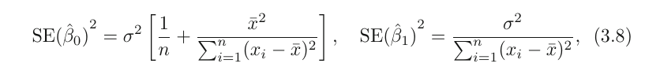
$\sigma^2$ is generally not known, but we can use an estimate called **residual standard error**  which is calculated as follows:
$$RSE = \sqrt{RSS/(n-2)}$$

Standard errors can be used to compute **confidence intervals**.
For linear regression, the 95 % confidence interval for β1
approximately takes the form
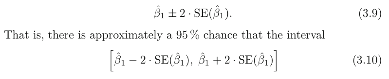
the factor of 2 in front of the SE(β̂1 ) term will vary slightly depending on the number of observations n in the linear regression. To be precise, rather than the number 2, it should contain the 97.5 % quantile of a t-distribution with n−2 degrees of freedom. 
We can also use this for hypothesis testing. To test the null hypothesis, we need to determine whether β̂1 , our estimate for β1 , is sufficiently far from zero that we can be confident that β1 is non-zero. How far depends on SE(β̂1). small SE allows for small numbers, and in contrast, if SE is large, we need a large b1 to tell us that b1 = 0. 
We're actually computing the t statistic,
$$
t = {\hat{\beta_1} - 0\over SE(\beta_1)}$$
which measures the number of standard deviations that β̂1 is away from 0. We can also compute the p-value.

### 3.1.3 Assessing the accuracy of our model
Once we've rejected the null hypotheses, we would likely want to know to what extend our model fits the data.  The quality of a linear regression fit is typically assessed using two related quantities: the residual standard error (RSE) and the $R^2$ Rstatistic.

### RSE
Recall that because of the irreducable error, we won't be able to perfectly predict Y anyway. RSE is an estimate of the std of $\epsilon$.  Roughly speaking, it is the average amount that the response
will deviate from the true regression line. It is computed using the formula
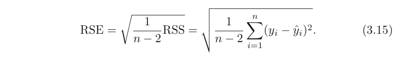
In table 3.2, we have an RSE of 3.26.  Another way to think about this is that even if the model were correct and the true values of the unknown coefficients β0 and β1 were known exactly, any prediction of sales on the basis of TV
advertising would still be off by about 3.260 units on average.
It depends on the context wether this is acceptable. In the advertising data set, the mean value of sales over all markets is approximately 1 units, and so the percentage error is
3.260/14 = 23 %.
The RSE is considered a measure of the lack of fit of the model to the data. As it increases, we know that predicted response will be further of from true response. 

### R^2 statistic
The RSE provides an absolute measure of lack of fit of the model to the data. But since it is measured in the units of Y , it is not always clear what constitutes a good RSE. The $R^2$ statistic provides an alternative measure of fit. It takes the form of a proportion—the proportion of variance explained—and so it always takes on a value between 0 and 1, and is independent of the scale of Y .

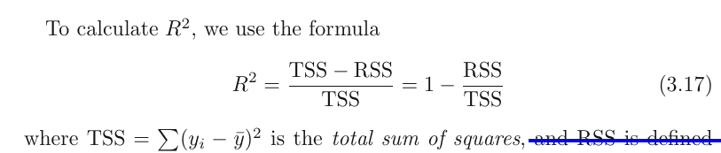

TTS is the total variance in Y. TSS - RSS is the ammount of variability that can be explained with the regression. $R^2$ is the proportion of the variability of Y that can be explained with X. Higher is better. If it's low, regression did not explain much of the variability, and may be due the fact that the real world problem isnt linear at all or that the inherent error $\sigma^2$ is high. 
The pro is that it's way more interpretable than RSE. How close to 1 is acceptable depends on the context. In physics, a number that's not extremely close to 1 might indicate a serious problem with the experiment, but in biology, sociology, etc, a value of 0.1 might be realistic. Also, correlation(r) is another good measure. In simple linear regression, $R^2 = r^2$ 
Note that this is only for simple lin. regression. For multiple linear regression, we need $R^2$

## 3.2 Multiple regression
How can we extend our simple linear regression model to radio, tv and newspaper advertisments?
We could simply make 3 simple lin. regression models, but this would be kinda wrong. Not only are we then ignoring the effects of the other 2 predictors for each model, we also remove the way to predict sales when multiple predictors are tweaked. 
The better thing to do is to extend our model to include multiple predictors, like so:

$$
Y = \beta_0 + \beta_1 X_1 + \ldots + \beta_p X_p
$$

Any Xj then represents the jth predictor, and $\beta_j$ the average effect of Xj on the response. 

###     3.2.1 Estimating the regression coefficients

We use the same least squares method for this. that is:
$$
RSS = \sum (y_i - \hat{y}_i)^2 = \sum (y_i - \beta_0 - \beta_1 X_1 - \ldots - \beta_p X_p)^2
$$
The formulla used to calculate the coefficients is out of the scope of this book.

### 3.2.2 Some important Questions
#### Is There a Relationship Between the Response and Predictors?

To answer this, we test the null hypothesis:
H0 : every $X_i$ is zero.
We do this with the **F-statistic**

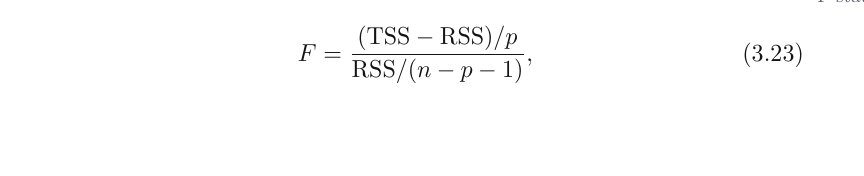
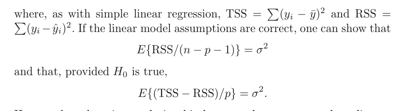
Hence, when there is no relationship between the response and predictors,
one would expect the F-statistic to take on a value close to 1, and a lot greater than 1 otherwise.

The larger the number of datapoints n, the smaller F has to be to reject the null hypothesis. Every good software package provides a way to calculate the **p-value** associated with the F-statistic using this distribution. Based on this p-value, we can determine whether or not to reject H0 . 

Sometimes we only want to see wether a subset q of the coefficients is zero. We just create a model with only those subset of predictors, and do the same analysis as above, but this time, 
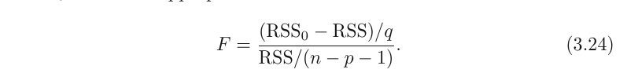

**if p > n, we can't fit the linear regression model with least squares, so we don't use the F statistic, or most concepts discussed in this chapter. When p is large, some of the approaches discussed in the next section, such as *forward selection*, can be used. This *high-dimensional* setting  will be discussed later.**

### Do all the predictors help to explain Y , or is only a subset of the predictors useful?

*Variable selection*, the practice of determining which predictors are associated with the response, in order to fit a single model involving only those predictors is extensively discussed in Ch6, but we'll go a bit in it here.

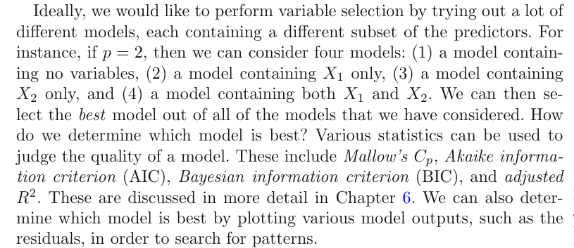
Unfortunately, we need to fit and test $2^p$ models, which might be very impractical, so we need an automated and efficient approach.
There are 3 classical approaches available:
* Forward selection. We start with a model with no predictors. We then test simple regression models for all p, selecting the one with the lowest RSS. We then test all models with 2 variables containing the previous one, again selecting the one with the lowest RSS. We keep this up untill some stopping rule says we stop (e.g. we only want 5 vars). 
* Backward selection. We start with a model with all predictors, removing the predictor with the largest p-value(The one that's the least statistically significant) and refitting the model. We continue this untill some stopping condition is satisifed, such as when all predictors are below some p-value treshold. 
* Mixed selection. Combination of the 2 mentioned already. We start with forward selection, adding statistically relevant variables. The p-values can change when new predictors are added, so we remove the variable when it's above some treshold.  We continue to perform these forward and backward steps until all variables in the model have a sufficiently low p-value, and all variables outside the model would have a large p-value if added to the model.

**Backward selection cannot be used if p > n, while forward selection can always be used. Forward selection is a greedy approach, and might include variables early that later become redundant. Mixed selection can remedy this.**

### How well does the model fit the data?
Two of the most common numerical measures of model fit are the RSE and $R^2$. 
$R^2$ close to one is desirable. We can compare models with x1,x2,x3 and x1,2,3,4 and look at the increase in $R^2$ If the increase is small, it supports the fact that we can drop x4. There's also RSE to consider. Read the section again at some other date, because you're still not certain how to use it.
We can also plot the data.  Graphical summaries can reveal problems
with a model that are not visible from numerical statistics. 
It can reveal *synergistic/interactive effects* (where predictors have effects on each other). We'll deal with extending linear models to acomodate for this later on. 

### Given a set of predictor values, what response value should we predict, and how accurate is our prediction?

Once we have our model, it's straightforward to get predictions from it. But there are 3 kinds of uncertainty associated with our predictions:
1. The coefficients are estimates, so the least square plane is an estimate to the *true population regression plane*.. This is related to the reducable error. We can compute a confidence interval in order to determine how close Ŷ will be to f (X)
2. Our model is an approximation of reality, an additional uncertaincy will be created in the form of bias. 
3. Even if we had the exact coefficients, we still have the irreducable error $\epsilon$. We use prediction intervals to see how far predicted Y will differ from Y. 

We use a **confidence interval** to quantify the uncertainty surrounding  the average sales over a large number of cities.   On the other hand, a **prediction interval** can be used to quantify the prediction uncertainty surrounding sales for a particular city. The prediction interval is substantially wider than the confidence interval, reflecting the increased uncertainty.

## 3.3 Other considerations in the regression model

### 3.3.1 Qualitative predictors
So far, we assumed our predictors are quantitative, which aint the case always. 

### 2level qualitative
We simply create a numerical dummy category and assign the categories 0 or 1.

## 2+ level qualitative
If we have something like ethnicity: caucasian, black, asian, etc
we could create multiplle dummy variables
caucasian 0 1
asian 0 1
black 0 1
etc
There are other equally valid methods

## 3.3.2 Extension of the linear regression model

There are a number of assumptions with the standard linear regression model.  Two of the most important assumptions state that the relationship between the predictors and response are additive (that predictors don't interact) and linear(for every increase of Xj, that there's a Bj increase).  There are a  number of sophisticated methods that relax these two assumptions. Here, we briefly examine some common classical approaches for extending the linear model

### Removing the additive assumption

Falling back on sales with predictors radio, tv and newspaper sales:
One way of extending this model to allow for interaction effects is to include a third predictor, called an interaction term, which is constructed by computing the product of X1 and X2 . This results in the model
$$
Y = \beta_0 + \beta_1 X_1 + \beta_2 X_2 \beta_3 X_1 X_2 + \epsilon = 
\beta_0 + (\beta_1 + \beta_3 X_2) X_1 + \beta_2 X_2 + \epsilon 
$$
We'll call $(\beta_1 + \beta_3 X_2)$ $\tilde{\beta_1}$ or interaction term

We can see in table 3.9 that the p-value of the interaction term is very low, so there is strong evidence to suggest there is a relation.
In this example, both X1, X2 and X1 X2 have small p-values, suggesting all 3 should be included in the model.
However, it is sometimes the case that an interaction term has a very small p-value, but the associated main effects (in this case, TV and radio) do not. **The hierarchical principle states that if we include an interaction in a model, we should also include the main effects, even if the p-values associated with principle their coefficients are not significant.**

### Non-linear Relationships

Here we present a very simple way to directly extend the linear model to accommodate non-linear relationships, using polynomial regression. We'll present more complex methods later. 

Take the example of miles per gallon with horsepower as predictor
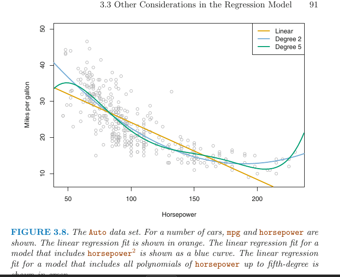
We clearly see a relationship, but we also see it's nonlinear. 
Now, the model looks like 
$$
Y = \beta_0 + \beta_1 hp + \beta_2 hp^2
$$
Again, we should look at the $R^2$ values, and we see improvement with adding the squared hp, but no additional benefit to adding more polynomals.

## 3.3.3 Potential problems

When we fit a lin. regression model to a dataset, many problems may occur, such as

1. Non-linearity of the response-predictor relationships.
2. Correlation of error terms.
3. Non-constant variance of error terms.
4. Outliers.
5. High-leverage points.
6. Collinearity.

In practice, identifying and overcoming these problems is as much an
art as a science. We'll only provide some key points, but remember that entire books have been written on this point.

### Nonlinearity of the data
if the relationship between predictors and response is far from linear, all conclusions drawn from a fitted linear regression model with this data are suspect. **Residual plots** are a great way to check for nonlinearity. 
we simply plot 
$$e_i = y_i = \hat{y_i}$$
and if we spot a pattern (Especially a clear U shape), they may be problems with the model, and hints that the problem isn't linear. 

If we spot a nonlinear problems, we can include nonlinear transformations such as log x, x^2, sqrt(X) to the model. We'll discus more advanced approaches later.

### 2. Correlation of Error Terms
we made the assumption that $\epsilon_0, \ldots, \epsilon_n$ are not correlated. The standard errors calculated are certainly based on that assumption. But if there is correlation, the estimated standard errors  will underestimate the true standard errors. Confidence and prediction intervals will be smaller than they should be. p-values will be lower. We may falsely conclude that a predictor is statistically significant. 
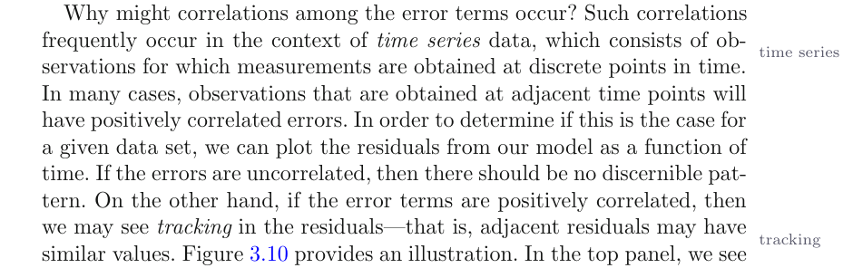
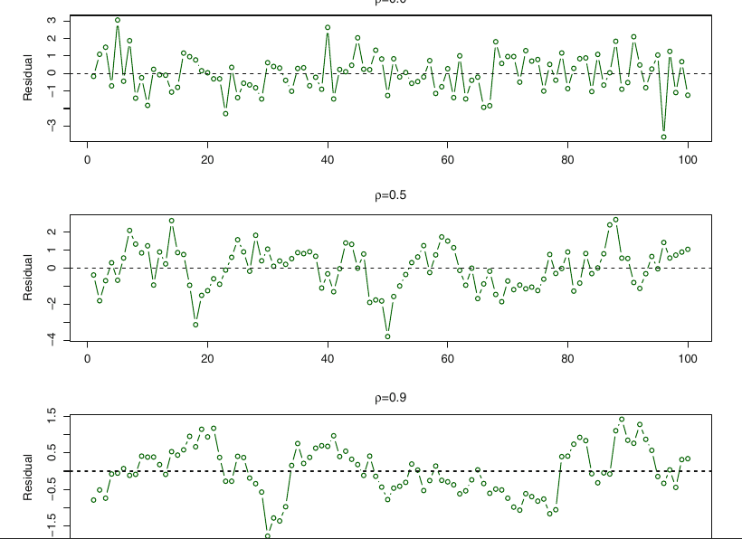
There are many different methods to take into account the correlation of error terms in time series data. But it can certainly happen outside of time series data. 
**In general, the assumption of uncorrelated errors is extremely important for linear regression as well as for other statistical methods, and good experimental design is crucial in order to mitigate the risk of such correlations.**

### 3. Non-constant Variance of Error Terms

Another important assumption is that the errors have a constant variance. The std, confidence intervals, and hypothesis tests associated with the linear model rely on it.  Unfortunately, it often isn't the case. An example is if the variance increases as Y does.

One can identify non-constant variances in
the errors, or **heteroscedasticity**, from the presence of a funnel shape in the residual plot.  When faced with this problem, one possible solution is to transform the response Y using a concave function such as log Y or sqrt(Y). If instead the error decreases, we could maybe use Y^2. Such a transformation results in a greater amount of shrinkage of the larger responses, leading to a reduction in heteroscedasticity. 
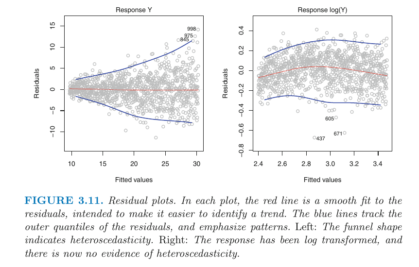

Sometimes we have a good idea of the variance of each response. For
example, the ith response could be an average of ni raw observations. If
each of these raw observations is uncorrelated with variance σ 2 , then their average has variance σi 2 = σ 2 /ni. In this case a simple remedy is to fit our model by **weighted least squares**, with weights proportional to the inverse weighted variances—i.e. wi = ni in this case. Most linear regression software allows for observation weights.

### Outliers
if Yi is far from predicted Yi. They arise from various causes, such as incorrect recording of data. 
It is typical for an outlier that does not have an unusual
predictor value to have little effect on the least squares fit. However, even if an outlier does not have much effect on the least squares fit, it can cause other problems. For instance, in this example, the RSE is 1.09 when the outlier is included in the regression, but it is only 0.77 when the outlier is removed. Since the RSE is used to compute all confidence intervals and p-values, such a dramatic increase caused by a single data point can have implications for the interpretation of the fit. Similarly, inclusion of the outlier causes the R2 to decline from 0.892 to 0.805.
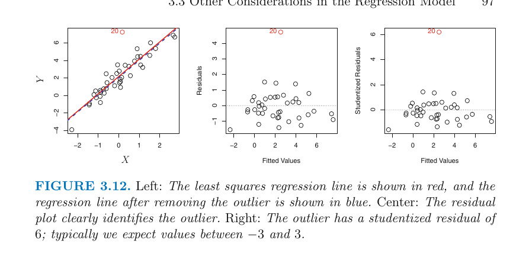
Residual plots can be used to identify outliers. But in practice, it can be difficult to decide how large a residual needs to be before we consider the point to be an outlier. To address this problem, instead of plotting the residuals, we can plot the **studentized residuals**, computed by dividing each residual ei by its estimated error. Observations whose studentized residuals are greater than 3 in absolute value are possible outliers.

If we believe that an outlier has occurred due to an error in data collection or recording, then one solution is to simply remove the observation. However, care should be taken, since an outlier may instead indicate a deficiency with the model, such as a missing predictor.

### 5. High Leverage Points

This is kinda the reverse of an outlier. Instead of having a unusual Y for an X, observations with **high leverage** have an unusual X. 
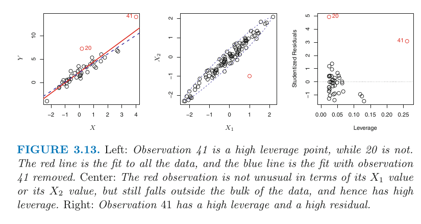

High leverage observations tend to have a sizable impact on the estimated regression line. It is cause for concern if the least squares line is heavily affected by just a couple of observations, because any problems with these points may invalidate the entire fit. 

In a simple linear regression, high leverage observations are fairly easy to identify, since we can simply look for observations for which the predictor value is outside of the normal range of the observations. But in a multiple linear regression with many predictors, it is possible to have an observation that is well within the range of each individual predictor’s values, but that is unusual in terms of the full set of predictors. We can see an example in 3.13 center. 

In order to quantify an observation’s leverage, we compute the leverage
statistic. 

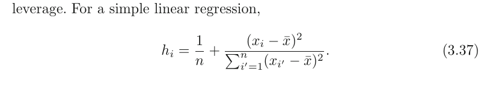

There is a simple extension of hi to the case of multiple predictors, though we do not provide the formula here. The leverage statistic hi is always between 1/n and 1, and the average leverage for all the observations is always equal to (p + 1)/n. So if a given observation has a leverage statistic that greatly exceeds (p+ 1)/n, then we may suspect that the corresponding point has high leverage.

Beware of observations with very high leverage statistic as well as a
high studentized residual. A dangerous combo. 

### 6. Colinearity
This refers to when 2 or more variables are closely related/dependent.  The presence of collinearity can pose problems in the regression context, since it can be difficult to separate out the individual effects of collinear variables on the response.

The left-hand panel of Figure 3.15 is a contour plot of the RSS (3.22)
associated with different possible coefficient estimates for the regression of balance on limit and age . 

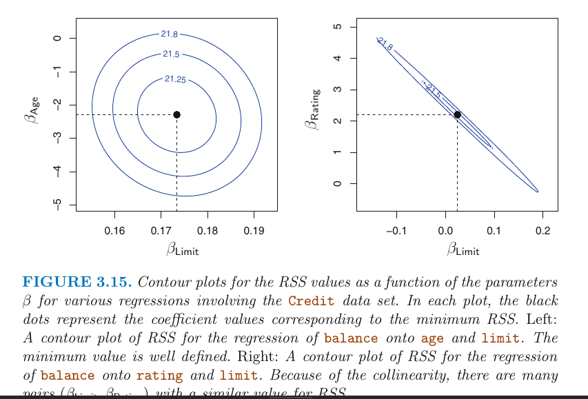

**Blah blagh GO READ THE TEXT AGAIN**
This results in a great deal of uncertainty in the
coefficient estimates. 

Since collinearity reduces the accuracy of the estimates of the regression coefficients, it causes the standard error for β̂j to grow. Recall that the t-statistic for each predictor is calculated by dividing β̂j by its standard error. Consequently, collinearity results in a decline in the t-statistic. As a result, in the presence of collinearity, we may fail to reject H0 : βj = 0. This means that the power of the hypothesis test—the probability of correctly  detecting a non-zero coefficient—is reduced by collinearity.

In other words,  In other words, the importance of colinear variables are masked due to the presence of collinearity.
A simple way to detect collinearity is to look at the correlation matrix
of the predictors.
Unfortunately, not all collinearity problems can be detected by inspection of the correlation matrix: it is possible for collinearity to exist between three or more variables even if no pair of variables
has a particularly high correlation. We call this situation **multicollinearity**. 

A better way to assess multicollinearity is to compute the **variance inflation factor** (VIF). The VIF is  the ratio of the variance of β̂j when fitting the full model divided by the variance of β̂j if fit on its own. The smallest possible value for VIF is 1, which indicates the complete absence of collinearity. Typically in practice there is a small amount of collinearity among the predictors. Good rule of thumb: **VIF > 5 or 10 = BAD!!**

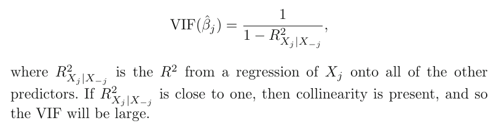

When faced with the problem of collinearity, there are two simple solu-
tions. The first is to drop one of the problematic variables from the regression. This isn't a huge loss, because colinearity indicates that one of them is redundant in the presence of the other variable(s).
The second solution is to combine the collinear variables together into a single predictor. For instance, we might take the average of standardized versions of limit and rating in order to create a new variable that measures credit worthiness.

## 3.4 The marketing plan
Go read it again, it's just an answer of the questions asked at the start of the chapter about a particular dataset, answered with the concepts introduced so far. 

## 3.5 Comparison with K nearest neighbours (KNN)
Linear regression is a parametric approach, because it makes an assumption about the form of Y. TThese approaches have advantages, such as ease of fitting, ease of interpreting, etx. Recall the disadvantages too. if the assumed form is far removed from reality, it makes a poor predictor. We'll take a look at one of the simplest and best known nonparametric approaches, K-nearest neighbours.
KNN regression is closely related to KNN classification. The predicted response for a set of predictors is the average of the $\mathcal{N}$ nearest neighbours.  In general, the optimal value for K will depend on the bias-variance tradeoff. 

Where will least squares linear regression outperform KNN?
**the parametric approach will outperform the nonparametric approach if the parametric form that has been selected is close to the true form of f**.
In this case, a non-parametric approach incurs a cost in variance
that is not offset by a reduction in bias.

In a real life situation in which the true relationship is unknown, one might draw the conclusion that KNN should be favored over linear regression because it will at worst be slightly inferior than linear regression if the true relationship is linear, and may give substantially better results if the true relationship is non-linear.
But in reality, even when the true relationship is highly non-linear, KNN may still provide inferior results to linear regression. In higher
dimensions, KNN often performs worse than linear regression.
This decrease in performance as the dimension increases is a common
problem for KNN, and results from the fact that in higher dimensions
there is effectively a reduction in sample size.
As a general rule, parametric methods will tend to outperform non-parametric approaches when there is a small number of observations per predictor.

# Excercises

1. Describe the null hypotheses to which the p-values given in Table 3.4
correspond. Explain what conclusions you can draw based on these
p-values. Your explanation should be phrased in terms of sales, TV,
radio, and newspaper, rather than in terms of the coefficients of the
linear model.

**The p-values of Intercept, radio and TV are extremely close to 0, and we can reject the null hypotheses of these. Furthermore, these also have a high T-value, further strengthening this.
This is in opposition to newspaper, with low t-values and high p-values, meaning that there isn't a strong correlation between newspaper and sales.**

2.Carefully explain the differences between the KNN classifier and KNN
regression methods.

KNN classifier returns a category, regression returns a number.
classifier returns the category, and the probability samecategory/neighbours.
regression returns the mean of all the neighbours nearby.

Suppose we have a data set with five predictors, X1 = GPA, X2 = IQ,
X3 = Gender (1 for Female and 0 for Male), X4 = Interaction between
GPA and IQ, and X5 = Interaction between GPA and Gender. The
response is starting salary after graduation (in thousands of dollars).
Suppose we use least squares to fit the model, and get β̂0 = 50, β̂1 =
20, β̂2 = 0.07, β̂3 = 35, β̂4 = 0.01, β̂5 = −10.

For a fixed value of IQ and GPA, males earn more on average
than females.

**False.  As long as GPA < 3.5, females earn more**

For a fixed value of IQ and GPA, females earn more on
average than males.
**false, for a gpa > 3.5, male earns more**

iii. For a fixed value of IQ and GPA, males earn more on average
than females provided that the GPA is high enough.
**True**

Predict the salary of a female with IQ of 110 and a GPA of 4.0.
**200 + 7.7 + 35 + 4.4 -40 = 207.1 x thousand**

True or false: Since the coefficient for the GPA/IQ interaction
term is very small, there is very little evidence of an interaction
effect. Justify your answer.

False. **You have to look at the p values, the R values and the t value for that**

4. I collect a set of data (n = 100 observations) containing a single
predictor and a quantitative response. I then fit a linear regression
model to the data, as well as a separate cubic regression, i.e. Y =
β0 + β1 X + β2 X 2 + β3 X 3 + .

(a) Suppose that the true relationship between X and Y is linear,
i.e. Y = β0 + β1 X + elipson. Consider the training residual sum of
squares (RSS) for the linear regression, and also the training
RSS for the cubic regression. Would we expect one to be lower
than the other, would we expect them to be the same, or is there
not enough information to tell? Justify your answer.

**cubic expression would either be the same or larger. The same, because the model can compute the betas > 1 to be zero. Or larger, if it finds patterns that aren't there**

(b) Answer (a) using test rather than training RSS.
**We would find low t values for the betas > 1.**

(c) Suppose that the true relationship between X and Y is not linear,
but we don’t know how far it is from linear. Consider the training
RSS for the linear regression, and also the training RSS for the
cubic regression. Would we expect one to be lower than the
other, would we expect them to be the same, or is there not
enough information to tell? Justify your answer.

**I expect the RSS to be lower for cubic regression, because it'll be able to model it better**

