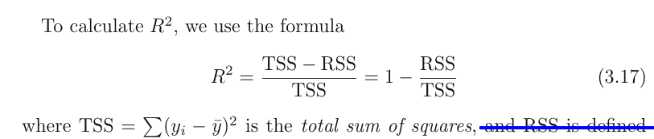
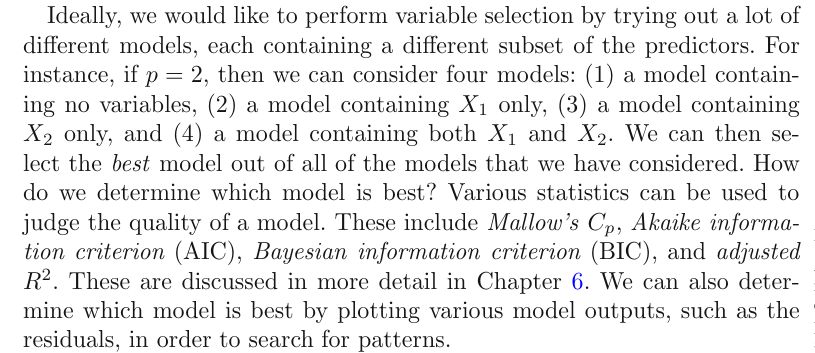

# Linear regression

Though it may seem somewhat dull compared to some of the more modern statistical learning approaches described in later chapters of this book, linear regression is still a useful and widely used statistical learning method. Moreover, it serves as a good jumping-off point for newer approaches: as we will see in later chapters, many fancy statistical learning approaches can be seen as generalizations or extensions of linear regression. Consequently, the importance of having a good understanding of linear regression before studying more complex learning methods cannot be overstated. 

## 3.1 Simple linear regression
is a very straightforward simple linear approach for predicting a quantitative response Y on the basis of a single predictor variable X. It assumes that there is approximately a linear relationship between X and Y 
$$
Y \approx \beta_0 + \beta_1 X
$$
Which we can read as Y is approximately modeled as, or we are regressing Y onto x.
In this case with just 2 parameters, beta0 is the intercept and beta1 is the slope. 

### 3.1.1 Estimating coefficients
We can create observation pairs $(x_i, y_i)$, and then obtain coefficient estimates such that f(xi) approximates yi. There are different ways to measure *closeness*; The prevailing method is the least squares method. 

Let ŷi = β̂0 + β̂1 xi be the prediction for Y based on the ith value of X.
Then ei = yi − ŷ i represents the ith residual—this is the difference between the ith observed response value and the ith response value that is predicted by our linear model. We define the residual sum of squares (RSS) as follows:
$$
RSS = e_1^2 + e_2^2 + \ldots + e_n^2 
$$
Using some calculus, we can show that

$$
\hat{\beta}_1 = {\sum (x_i = \bar{x})(y_i - \bar{y})\over \sum (x_i - \bar{x})^2} \\
\hat{\beta}_0 = \bar{y} - \beta_1 \bar{x}
$$

### 3.1.2 Assessing the acuracy
Recall that expected Y was f + irreducable error. This means that for our simple linear regression, 
$\hat{Y} = \beta_0 + \beta_1 X + \epsilon$

The error term is a catch-all for what we miss with this simple model: the true relationship is probably not linear, there may be other variables that cause variation in Y , and there may be measurement error. We typically assume that the error term is independent of X. 
The model defines the population regression line(the real model without error), which is the best linear approximation to the true relationship between X and Y.
in real applications, we have access to a set of observations from which we can compute the least squares line; however, the population regression line is unobserved.
Typically, the training data is sampled multiple times so we can compute multiple least square lines. This allows us to decrease bias, because each line will be higher or lower, meaning no systematic bias. Kinda like population mean and sample mean. 
To go futher with our mean analogy, how do we compute how far the sample mean is from the actual mean? We do this with standard error

$$SE(\hat{\mu})^2 = {\sigma^2 \over n}$$

similarly,

$\sigma^2$ is generally not known, but we can use an estimate called **residual standard error**  which is calculated as follows:
$$RSE = \sqrt{RSS/(n-2)}$$

Standard errors can be used to compute **confidence intervals**.
For linear regression, the 95 % confidence interval for β1
approximately takes the form

the factor of 2 in front of the SE(β̂1 ) term will vary slightly depending on the number of observations n in the linear regression. To be precise, rather than the number 2, it should contain the 97.5 % quantile of a t-distribution with n−2 degrees of freedom. 
We can also use this for hypothesis testing. To test the null hypothesis, we need to determine whether β̂1 , our estimate for β1 , is sufficiently far from zero that we can be confident that β1 is non-zero. How far depends on SE(β̂1). small SE allows for small numbers, and in contrast, if SE is large, we need a large b1 to tell us that b1 = 0. 
We're actually computing the t statistic,
$$
t = {\hat{\beta_1} - 0\over SE(\beta_1)}$$
which measures the number of standard deviations that β̂1 is away from 0. We can also compute the p-value.

### 3.1.3 Assessing the accuracy of our model
Once we've rejected the null hypotheses, we would likely want to know to what extend our model fits the data.  The quality of a linear regression fit is typically assessed using two related quantities: the residual standard error (RSE) and the $R^2$ Rstatistic.

### RSE
Recall that because of the irreducable error, we won't be able to perfectly predict Y anyway. RSE is an estimate of the std of $\epsilon$.  Roughly speaking, it is the average amount that the response
will deviate from the true regression line. It is computed using the formula

In table 3.2, we have an RSE of 3.26.  Another way to think about this is that even if the model were correct and the true values of the unknown coefficients β0 and β1 were known exactly, any prediction of sales on the basis of TV
advertising would still be off by about 3.260 units on average.
It depends on the context wether this is acceptable. In the advertising data set, the mean value of sales over all markets is approximately 1 units, and so the percentage error is
3.260/14 = 23 %.
The RSE is considered a measure of the lack of fit of the model to the data. As it increases, we know that predicted response will be further of from true response. 

### R^2 statistic
The RSE provides an absolute measure of lack of fit of the model to the data. But since it is measured in the units of Y , it is not always clear what constitutes a good RSE. The $R^2$ statistic provides an alternative measure of fit. It takes the form of a proportion—the proportion of variance explained—and so it always takes on a value between 0 and 1, and is independent of the scale of Y .

TTS is the total variance in Y. TSS - RSS is the ammount of variability that can be explained with the regression. $R^2$ is the proportion of the variability of Y that can be explained with X. Higher is better. If it's low, regression did not explain much of the variability, and may be due the fact that the real world problem isnt linear at all or that the inherent error $\sigma^2$ is high. 
The pro is that it's way more interpretable than RSE. How close to 1 is acceptable depends on the context. In physics, a number that's not extremely close to 1 might indicate a serious problem with the experiment, but in biology, sociology, etc, a value of 0.1 might be realistic. Also, correlation(r) is another good measure. In simple linear regression, $R^2 = r^2$ 
Note that this is only for simple lin. regression. For multiple linear regression, we need $R^2$

## 3.2 Multiple regression
How can we extend our simple linear regression model to radio, tv and newspaper advertisments?
We could simply make 3 simple lin. regression models, but this would be kinda wrong. Not only are we then ignoring the effects of the other 2 predictors for each model, we also remove the way to predict sales when multiple predictors are tweaked. 
The better thing to do is to extend our model to include multiple predictors, like so:

$$
Y = \beta_0 + \beta_1 X_1 + \ldots + \beta_p X_p
$$

Any Xj then represents the jth predictor, and $\beta_j$ the average effect of Xj on the response. 

###     3.2.1 Estimating the regression coefficients

We use the same least squares method for this. that is:
$$
RSS = \sum (y_i - \hat{y}_i)^2 = \sum (y_i - \beta_0 - \beta_1 X_1 - \ldots - \beta_p X_p)^2
$$
The formulla used to calculate the coefficients is out of the scope of this book.

### 3.2.2 Some important Questions
#### Is There a Relationship Between the Response and Predictors?

To answer this, we test the null hypothesis:
H0 : every $X_i$ is zero.
We do this with the **F-statistic**

Hence, when there is no relationship between the response and predictors,
one would expect the F-statistic to take on a value close to 1, and a lot greater than 1 otherwise.

The larger the number of datapoints n, the smaller F has to be to reject the null hypothesis. Every good software package provides a way to calculate the **p-value** associated with the F-statistic using this distribution. Based on this p-value, we can determine whether or not to reject H0 . 

Sometimes we only want to see wether a subset q of the coefficients is zero. We just create a model with only those subset of predictors, and do the same analysis as above, but this time, 

**if p > n, we can't fit the linear regression model with least squares, so we don't use the F statistic, or most concepts discussed in this chapter. When p is large, some of the approaches discussed in the next section, such as *forward selection*, can be used. This *high-dimensional* setting  will be discussed later.**

### Do all the predictors help to explain Y , or is only a subset of the predictors useful?

*Variable selection*, the practice of determining which predictors are associated with the response, in order to fit a single model involving only those predictors is extensively discussed in Ch6, but we'll go a bit in it here.

Unfortunately, we need to fit and test $2^p$ models, which might be very impractical, so we need an automated and efficient approach.
There are 3 classical approaches available:
* Forward selection. We start with a model with no predictors. We then test simple regression models for all p, selecting the one with the lowest RSS. We then test all models with 2 variables containing the previous one, again selecting the one with the lowest RSS. We keep this up untill some stopping rule says we stop (e.g. we only want 5 vars). 
* Backward selection. We start with a model with all predictors, removing the predictor with the largest p-value(The one that's the least statistically significant) and refitting the model. We continue this untill some stopping condition is satisifed, such as when all predictors are below some p-value treshold. 
* Mixed selection. Combination of the 2 mentioned already. We start with forward selection, adding statistically relevant variables. The p-values can change when new predictors are added, so we remove the variable when it's above some treshold.  We continue to perform these forward and backward steps until all variables in the model have a sufficiently low p-value, and all variables outside the model would have a large p-value if added to the model.

**Backward selection cannot be used if p > n, while forward selection can always be used. Forward selection is a greedy approach, and might include variables early that later become redundant. Mixed selection can remedy this.**

### How well does the model fit the data?

### Given a set of predictor values, what response value should we predict, and how accurate is our prediction?

